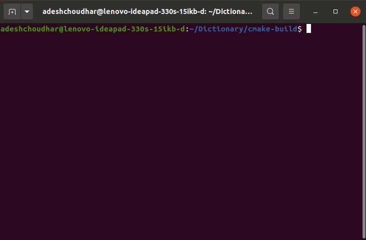

# Dictionary

## DSA-II mini project

Dictionary is a project written in C and Python that uses a text file as a knowledge base, performs functions such as meaning/autocompletion of a word, spell-checking a word/file.

## Prerequisites

- GCC-11
- CMake (>=3.17)

## Install and build

Change the directory to the root directory of the project `Dictionary`, then follow the steps are given below to build the project for the first time.

```
mkdir <directory_name>
cd <directory_name>
cmake ..
```

Then to build each time, use `make` in the directory created in the previous step. Refer [this](media/install_build.gif) demo, if needed.

## Abbreviations used

> - HASH: Hash Table
> - TRIE: Trie
> - TERN: Ternary Search Tree

## Commands

`./Dictionary -h` will provide you a help page as shown below to use various features.

```
+===========+
|   HELP    |
+===========+

<0> HELP        = Usage: ./Dictionary [-h/--help]
<1> MEANINGS    = Usage: ./Dictionary
<2> GUESS       = Usage: ./Dictionary -g [--TRIE/--TERN] <word>
<3> SPELL-CHECK = Usage: ./Dictionary -s [--HASH/--TRIE/--TERN] [<word>/<file>]
<4> COMPARE     = Usage: ./Dictionary -c [<word>/<file>]
```

## Flowchart


## Features

<details>

<summary>
MEANING
</summary>

Exhibits the basic functionality of providing the meaning of a word.  
[meaning.py](meaning.py) is handling the API call part. The free external API used here is:

> https://dictionaryapi.dev


</details>

<details>

<summary>
GUESS
</summary>

Suggest words according to the **longest valid prefix** in the input argument. Uses option `TRIE` or `TERN` to select and use the respective data structure to perform this feature.  


</details>

<details>

<summary>
SPELL-CHECK
</summary>

Takes option `--HASH` or `--TRIE` or `--TERN` to select and use the respective data structure. Then displays various parameters regarding time and memory required.


| Word                                            | File                                                                                                            |
| ----------------------------------------------- | --------------------------------------------------------------------------------------------------------------- |
| Checks validity/spelling of that word.          | Checks the spelling of all the words and list down all the misspelled words in [misspelled.txt](misspelled.txt) |
|  |                                                                  |

</details>

<details>

<summary>
COMPARE
</summary>

Compares and helps to visualize time and memory required while performing spell-checking process by all three data structures. Gives a complete analysis and statistics in terminal and visualization with graphs using `gnuplot`
pipeline.


</details>

## Mentor

Asst. Prof. Shrida Kalamkar

## References

- https://cs50.harvard.edu/x/2021/psets/5/
- http://www.gnuplot.info/links.html
